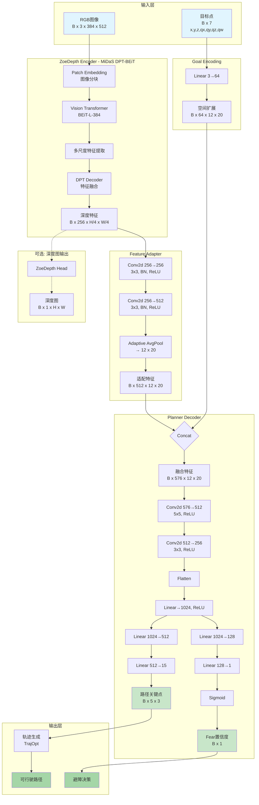
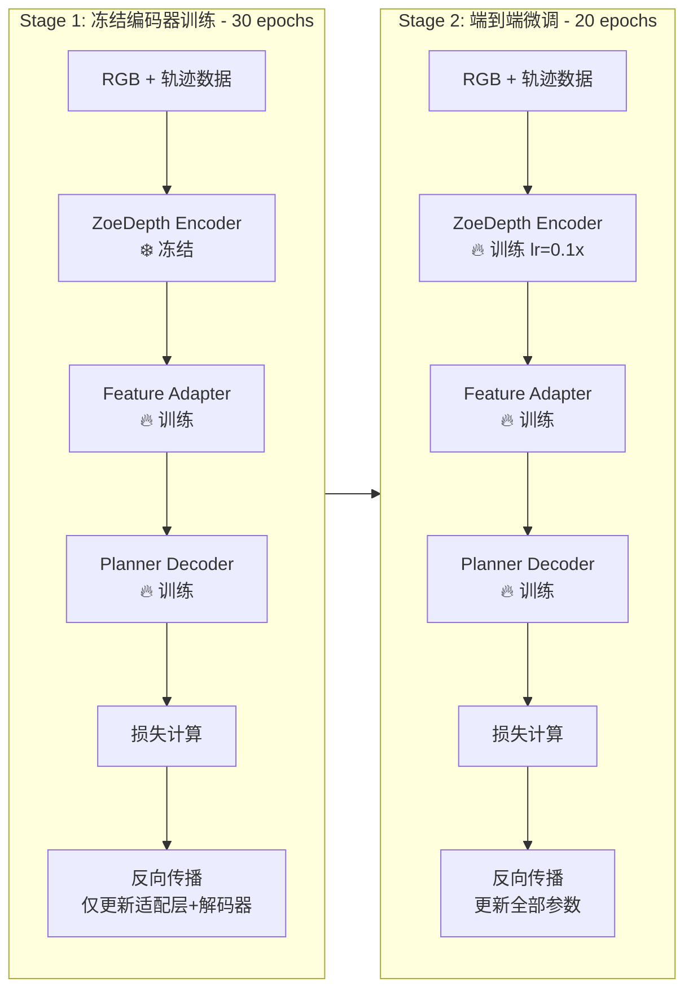
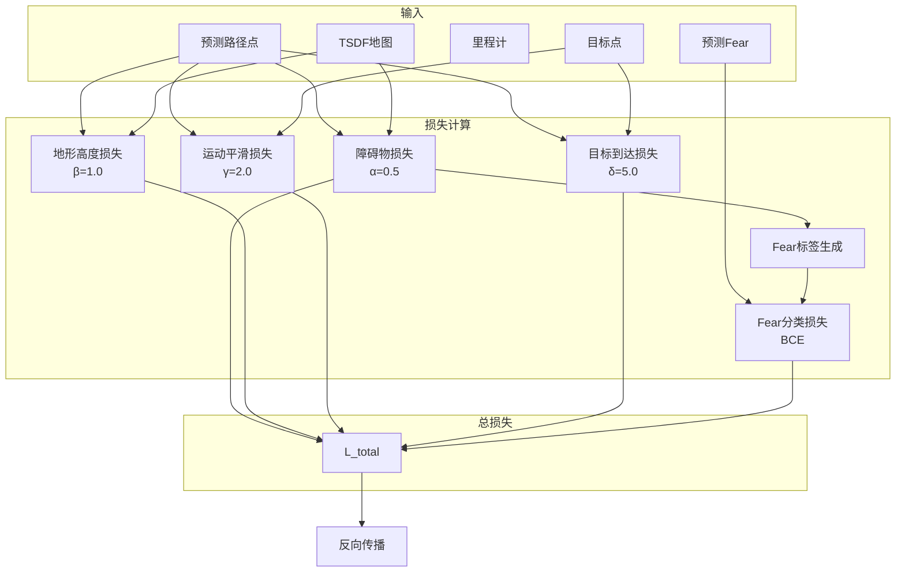
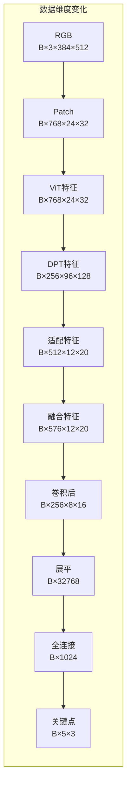
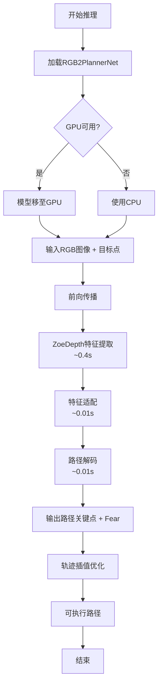
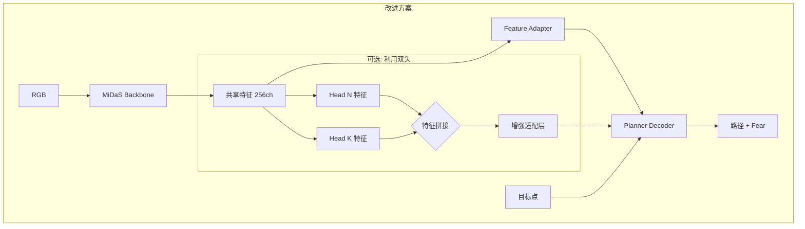

## **RGB2PlannerNet**端到端网络架构图


## 两阶段训练流程


## 损失函数组成图


## 数据流与维度变化图


## 推理流程图


## 双头特征


## 残差链接架构
```mermaid
graph TB
    subgraph RGB2PlannerNet["RGB2PlannerNet (带残差连接)"]
        RGB[RGB输入] --> BACKBONE[MiDaS DPT<br/>Backbone]
        
        BACKBONE --> FEAT[共享特征<br/>256ch]
        BACKBONE --> OUT[多尺度特征<br/>x_blocks]
        BACKBONE --> BTL[瓶颈特征<br/>btlnck]
        
        BTL --> ROUTER[Domain Router]
        ROUTER --> SELECT{选择头}
        
        BTL --> HEAD_N[Metric Head N<br/>NYU]
        BTL --> HEAD_K[Metric Head K<br/>KITTI]
        OUT --> HEAD_N
        OUT --> HEAD_K
        
        HEAD_N --> BEMB_N[bin_embedding N<br/>128ch]
        HEAD_K --> BEMB_K[bin_embedding K<br/>128ch]
        
        BEMB_N --> RESIDUAL_ADAPTER[残差适配层<br/>MetricHeadResidualAdapter]
        BEMB_K -.-> RESIDUAL_ADAPTER
        
        FEAT --> ADAPTER[Feature Adapter<br/>256→512ch]
        ADAPTER --> ADD((+))
        RESIDUAL_ADAPTER --> |残差连接<br/>scale=0.1| ADD
        
        ADD --> DECODER[Planner Decoder]
        GOAL[目标点] --> DECODER
        DECODER --> PATH[路径关键点]
        DECODER --> FEAR[Fear置信度]
    end

    style HEAD_N fill:#e3f2fd
    style HEAD_K fill:#fff3e0
    style RESIDUAL_ADAPTER fill:#e8f5e9
    style ADD fill:#ffeb3b
    ```